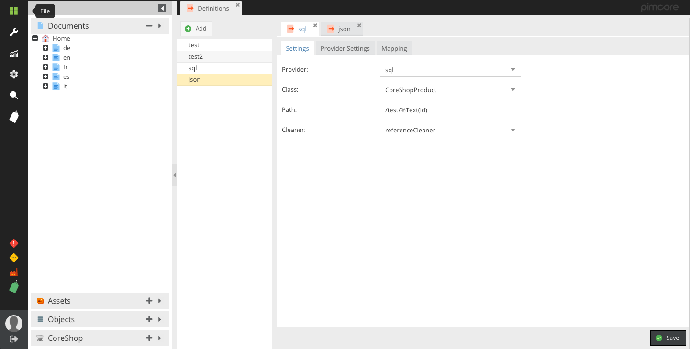

# Pimcore - Import Definitions

Import Definitions allows you to define your Object Import using a nice GUI and re-run the imports as often you like. Everything within Import Definitions is extendable.
Currently following providers are supported:

 * CSV
 * SQL-Table
 * JSON (only when max-depth = 1)

You can always programm a custom provider which takes care of imports. Just take a look at the existing providers.


## Getting started

* Download Plugin and place it in your plugins directory
* Open Extension Manager in Pimcore and enable/install Plugin
* After Installation within Pimcore Extension Manager, you have to reload Pimcore
* Open Settings -> Definitions

## Providers
Currently, only 4 types of providers are available:

 - CSV
 - JSON
 - XML
 - SQL

Because, the data needs to be non-hierarchial, XML and JSON are very limited. You can write your own provider to prepare the data for the plugin. Todo that, you simply
need to create a new class within the "ImportDefinitions\Model\Provider" namespace and call

```
ImportDefinitions\Model\AbstractProvider::addProvider('YourProvider');
```

Take a look at the existing Providers to get a clue how they are working.

## Cleaner
A cleaner takes care about the clean-up process. It basically deletes or unpublishes the missing objects. Following Cleaners are currently available:

 - Deleter: Deletes missing objects
 - Unpublisher: Unpublishes missing objects
 - Reference Cleaner: Deletes only when no references exists, otherwise the object will be unpublished

To create your own cleaner your class needs to be in the namespace "ImportDefinitions\Model\Cleaner" and implement from "ImportDefinitions\Model\Cleaner\AbstractCleaner". You also need to add it:

```
ImportDefinitions\Model\Cleaner\AbstractCleaner::addClenaer('YourInterpreter');
```


## Interpreter
To prepare data before it goes to the Objects-Setter Method, there are these "Interpreters". Currently following are available:

 - AssetsUrl -> Downloads an Asset from an Url and saves it to a multihref field
 - AssetUrl -> Downloads an Asset from an Url and saves it to a href field
 - DefaultValue -> Saves and Static-Value (definied in the UI) to the field
 - Href -> solves the connection from an ID to an actual Pimcore Objet
 - MulitHref -> same as href, but for multihref fields

This probably doesn't satisfy your needs. But you can also write your own Interpreters. You just need to create a new class within the "ImportDefinitions\Model\Interpreter" namespace
and call

```
ImportDefinitions\Model\Interpreter\AbstractInterpreter::addInterpreter('YourInterpreter');
```

if you have to add some data within the UI, you also need to create a Pimcore Admin JS File:

```
pimcore.registerNS('pimcore.plugin.importdefinitions.interpreters.yourinterpreter');

pimcore.plugin.importdefinitions.interpreters.yourinterpreter = Class.create(pimcore.plugin.importdefinitions.interpreters.abstract, {

});

```

## Setter
A Setter sets the data to the object as it would be needed.

 - Objectbrick -> saves the data to an objectbrick
 - Localizedfield -> saves the data to the specific language field
 - Classificationstore -> Saves the data to a classificationstore field
 - Fieldcollection -> Saves the data to a fieldcollection

Of course, you can also implement your own Setters. Its basically the same as with Interpreters.

## Placeholders for Keys and Paths
Import Definitions allow you to specify a key and a path for the objects. To be really generic, you can use pimcores placeholders for that.

[https://www.pimcore.org/wiki/display/PIMCORE4/Placeholders](https://www.pimcore.org/wiki/display/PIMCORE4/Placeholders)


## Fieldcollections
Fieldcollections are something special here. Because they can (and will) have a 1:n relation, the connection between the Data and the Mapping is special.


As you can see in the screenshot above, we have to settings to make:

 - Field: Of course, the field from the Main Object
 - Keys: This is were the magic happens. Because fieldcollection may have a 1:n relation, we need to somehow map the Primary Key of the fieldcollection. This is done
  using a special CSV Syntax "FROM:TO,FROM:TO". The Interpreter will split the keys and search for the appropriate entry in the collection. If found, it will change the value,
  if its new, it will create a new entry. Because of the UI, you need to add this value to each entry of your fieldcollection mapping.

## List your Definitions (in CLI)

Run following command

```
pimcore/cli/console.php importdefinitions:list
```

You can see the ID, the name and the Provider

## Run your definition
Definitions can only run (at the moment) using the Pimcore CLI. To run your definition, use following command

```
pimcore/cli/console.php importdefinitions:run -d 1 -p "{\"file\":\"test.json\"}"
```

## Copyright and license 
Copyright: [Woche Pass AG](http://www.w-vision.ch)
For licensing details please visit [LICENSE.md](LICENSE.md) 

## Screenshots


